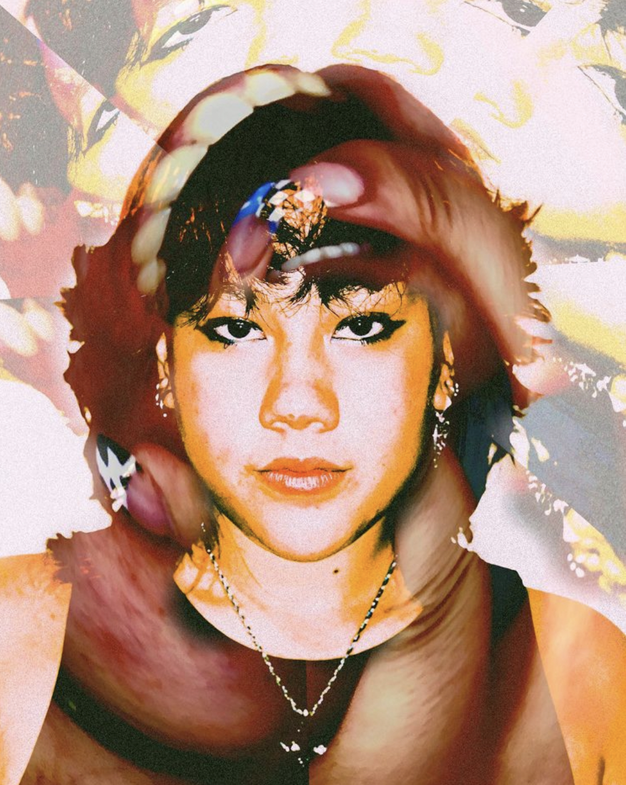
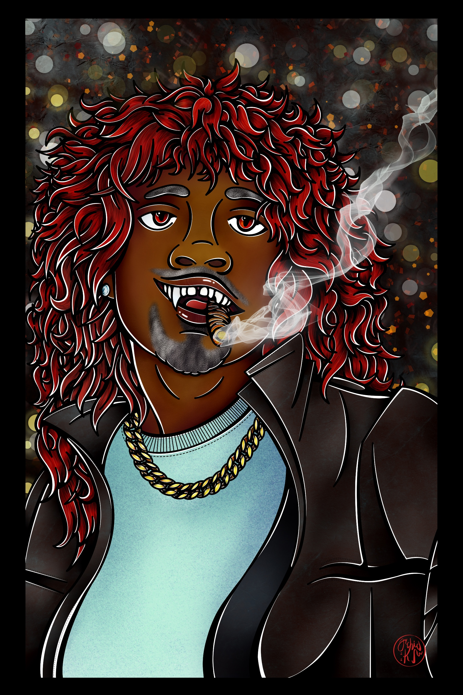
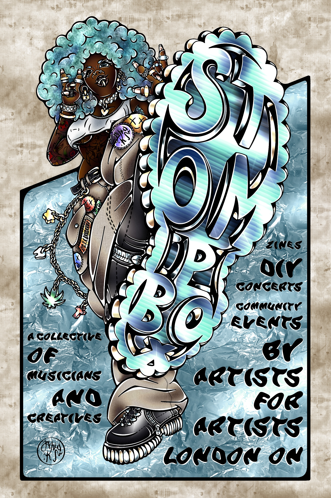
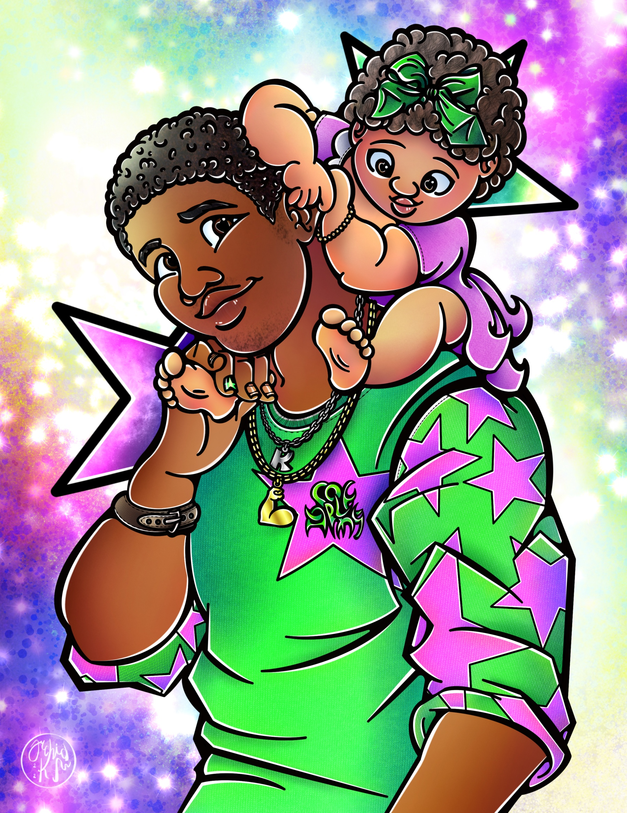
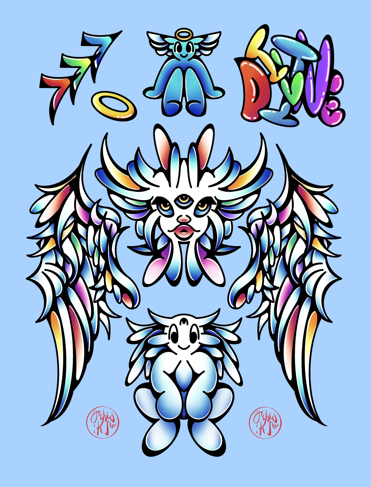

# BANDARRA MCDONALD COLLABORATIVE REPO
### Welcome to Our Respository:

**bandarra_mcdonald_hw1**

 This is a collaborative assignment for Multi-Media Authouring MMED-1054.

 **First, Introductions:**
 ## SYD BANDARRA
 
 ### Background

 I am 20 years old, was born and raised in London, Ontario. I went to Mother Theresa Catholic Secondary School. I have a 7-year-old Shih-Tzu/Weaton Terrier mix named Wookie and I have two younger siblings: My 19-year-old brother named Bryce and my 17-year-old sister named Rhya. My mom is Cambodian and my dad is Portuguese. I am a full-time artist who loves learning new things. I hope to gain more knowledge and experience in the design and development industry.

 ### Hobbies and Interests
 - **Tattoo Artistry**
 - **Fashion Design & Development and Tailoring**
 - **Digital Illustration and Animation**
    - 2D
    - 3D
- **Traditional Arts**
    - Painting
    - Scultpting
    - Drawing
    - Mixed-Media
- **Fibre Arts**
    - Crochet
    - Macrame
    - Stuffed toys and plushies
    - Textile Creation
- **Personal Style and Fashion Curation**
- **Live Concert Photography**

 ### Favourite Musicians
 1. Deftones
 2. Sevdaliza
 3. VIOLENT VIRA
 4. Citizen
 5. Flyleaf
 6. Scarlxrd
 7. NoName
 8. Hope Tala
 9. Holy Fawn
 10. Scorpions

 ### My Artwork

**Check Out These Links to See My Other Creations**
[view more of my digital artwork here](https://instagram.com/orchidinks?igshid=NTc4MTIwNjQ2YQ==)
[view my traditional artwork here](https://instagram.com/sydvabandarrart?igshid=NTc4MTIwNjQ2YQ==)

## LEYTON MCDONALD
