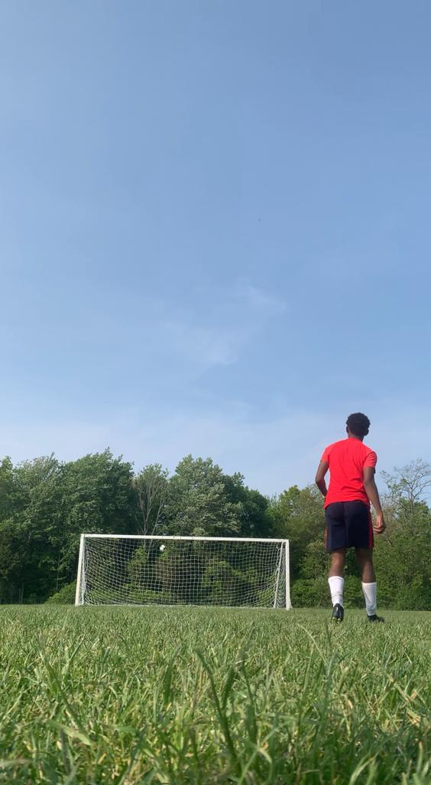

# BANDARRA MCDONALD COLLABORATIVE REPO
### Welcome to Our Respository:

**bandarra_mcdonald_hw1**

 This is a collaborative assignment for Multi-Media Authouring MMED-1054.

 **First, Introductions:**
 ## SYD BANDARRA
 **Background**

 I am 20 years old, was born and raised in London, Ontario. I went to Mother Theresa Catholic Secondary School. I have a 7-year-old Shih-Tzu/Weaton Terrier mix named Wookie and I have two younger siblings: My 19-year-old brother named Bryce and my 17-year-old sister named Rhya. My mom is Cambodian and my dad is Portuguese. I am a full time artist who loves learning new things. I hope to gain more knowledge and experience in the design and development industry.

 **Hobbies and Interests**

 **Favourite Music**

 **My Artwork**
 

## LEYTON MCDONALD

**Hobbies:**
1. Playing football (soccer).

2. Listening music

**Likes:**
1. Anything that has an engine and wheels

2. Stargazing

**Fav Movies:**
1. Fast and Furious 1-4

2. Cars 

[My Fav Website](https://www.aniwave.to)

